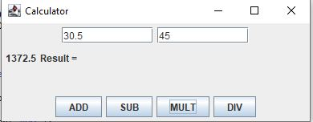
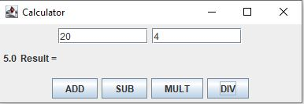
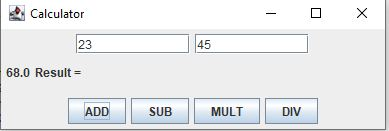
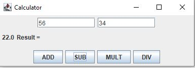
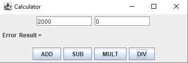
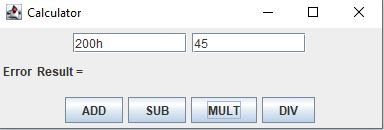

Create your very own Calculator!

# Table of contents

1. [Introduction](#Introduction)
2. [Features](#Features)
3. [Examples](#Examples)
4. [Basic Instruction](#Basic_Instruction)
5. [Things to Avoid](#Things_to_Avoid)
6. [Installation](#Installation)
7. [Contribute](#Contribute)
8. [Support Information](#Support_Information)
9. [License](#License)

# Introduction

This is documentation for a program that creates a basic calculator for the user to perform basic mathematical operations. The user will need a working installed Java runtime environment to run the calculator for themselves. 

# Features

* Allows User to input integers.
* Allows User to perform basic mathematic computations such as multiplication, division, addition, and subtraction.
* Prints the correct output based on the Users input and mathematic operation. 

# Examples

Here are some examples of input and output using the various mathematical operations provided in the created Calculator.

Multiplication:

Division:

Addition:

Subtraction:

# Basic Instruction

1. Install the application and run the provided code.
2. Run Calculator.java.
3. Enter integers in the provided white textboxes.
4. Click the buttons to perform basic mathematical operations. 
5. The user should then be able to observe the given output.

# Things to Avoid 

* Dividing by zero will result in an error.
* Entering words/strings or anything that is not an integer will result in an error. 

Example of errors:

# Installation

Click [here](https://github.com/ReecePollard55/Calculator/blob/gh-pages/src/solution/Calculator.java) to access the code necessary to run the Calculator.
This code can also be found in the solution folder under this pathway: Calculator/src/solution/Calculator.java

# Contribute

If you have any problems with the code or any suggestions to improve upon it please submit your feedback [here](https://github.com/ReecePollard55/Calculator/issues).

# Support Information

For any issues running or installing the provided program feel free to email me at: pollardrr@appstate.edu

# License 
[MIT License](https://github.com/ReecePollard55/Calculator/blob/gh-pages/MIT%20License)

